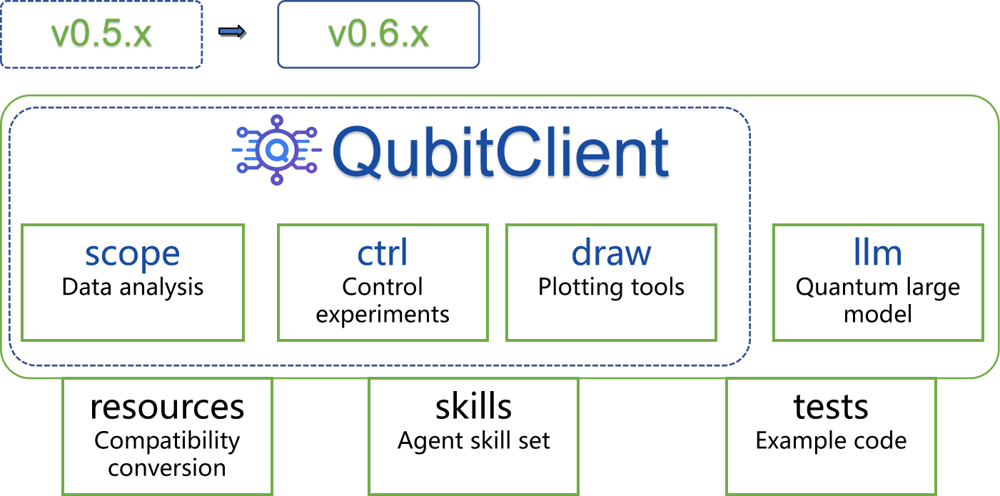

<h1 align="center">
  
  <br>
  QubitClient: AI Agent for Quantum Computing
</h1>

<p align="center">
  <a href="https://pypi.org/project/qubitclient/">
    
  </a>
  <a href="https://www.python.org/downloads/">
    
  </a>
  <a href="https://pypi.org/project/qubitclient/">
    
  </a>
  <a href="https://github.com/yaqiangsun/qubitclient/issues">
    
  </a>
  <a href="LICENSE">
    
  </a>
  <a href="https://github.com/yaqiangsun/qubitclient/commits/main">
    
  </a>
  
  
  <br>
  <a href="#-introduction">Introduction</a> •
  <a href="#-features">Features</a> •
  <a href="#-installation">Installation</a> •
  <a href="#-quick-start">Quick Start</a> •
  <a href="#-supported-task-types">Task Types</a> •
  <a href="#-documentation">Documentation</a> •
  <a href="#-license">License</a>
</p>

<p align="center">
  <a href="README.md">中文</a> | <b>English</b>
</p>

---

## 📖 Introduction

**QubitClient** is a powerful AI agent for efficient interaction with **Qubit services**. It provides rich API interfaces designed for quantum computing experiment data processing, supporting **feature extraction**, **parameter fitting**, **experiment control** and other tasks. It enables fast analysis of 2D spectrum, power shift curves and other key experiment data, with support for various data format conversions.

## 📂 Project Structure



## ✨ Features

- 🧠 **Intelligent Data Analysis**: Supports 2D spectrum analysis, power shift curve analysis and other complex tasks.
- 🔬 **Multiple Quantum Computing Tasks**: Includes S21 peak detection, optimal π pulse, Rabi oscillation, T1/T2 fitting and other common experiment analysis.
- 📦 **Flexible Data Input**: Accepts file paths, NumPy arrays, or dictionaries, adapting to different data sources.
- ⚡ **Batch Processing**: Easily process multiple data files simultaneously.
- 🔌 **Easy Integration**: Clean API design for quick integration into existing project workflows.
- 🤝 **MCP Protocol Support**: Real-time quantum measurement task control based on MCP protocol for experiment automation.
- 🤖 **LLM/VLM Integration**: Supports large language models and vision-language models for quantum measurement data analysis and decision-making.
  - 🟢 **Google Gemma 4**: Supports `google/gemma-4-E4B-it` model
  - 🔵 **NVIDIA Ising**: Supports `nv-community/Ising-Calibration-1-35B-A3B` model, optimized for quantum calibration

## 📦 Installation

Recommended installation using `pip`:

```bash
pip install qubitclient
```

For additional features like plotting, install the full version:

```bash
pip install qubitclient[full]
```

For detailed installation instructions, see [Installation Guide](docs/install.md).


#### 🐳 Service Deployment (Docker)

```bash
# Initialize deployment files (copy serve_templates to current directory)
qubitclient serve init

# Download models to model_zoo folder
qubitclient serve download

# Start all services (proxy, qubitserving, qubitscope)
qubitclient serve up

# Check service status
docker ps
```

## 🚀 Quick Start

### 1️⃣ Configuration

Initialize configuration files:

```bash
qubitclient init
```

This will create `qubitclient.json` and `.mcp.json` files. Then edit `qubitclient.json` with your server address and API key:

```json
{
  "url": "https://your-api-server.com",
  "api_key": "your-api-key"
}
```

### 2️⃣ Usage Examples
#### 🧠 NNScope Functions (SPECTRUM2D)

```python
from qubitclient import QubitNNScopeClient, NNTaskName, CurveType
import numpy as np

# Initialize the client
client = QubitNNScopeClient(url="http://your-server-address:port", api_key="your-api-key")

# Method 1: Directly using file paths
file_path_list = ["data/file1.npz", "data/file2.npz"]
response = client.request(
    file_list=file_path_list,
    task_type=NNTaskName.SPECTRUM2D,
    curve_type=CurveType.COSINE
)

# Method 2: Using NumPy array dictionaries
data_ndarray = np.load(file_path, allow_pickle=True)
dict_list = [data_ndarray]

response = client.request(
    file_list=dict_list,
    task_type=NNTaskName.SPECTRUM2D,
    curve_type=CurveType.POLY
)

# Get results
results = client.get_result(response=response)
```

#### 🔬 Scope Functions (OPTPIPULSE)

```python
from qubitclient import QubitScopeClient, TaskName
import numpy as np

# Initialize the client
client = QubitScopeClient(url="http://your-server-address:port", api_key="your-api-key")

# Prepare data (example)
dict_list = [{
    "x_data": np.array([...]),
    "y_data": np.array([...])
}]

response = client.request(
    file_list=dict_list,
    task_type=TaskName.OPTPIPULSE  # See task types list below for options
)

results = client.get_result(response=response)
```

#### 🤖 Ctrl Functions (MCP Protocol Measurement S21)

```python
from qubitclient.ctrl import QubitCtrlClient, CtrlTaskName

# Initialize the client
client = QubitCtrlClient()

# Execute S21 cavity frequency measurement experiment
result = client.run(
    task_type=CtrlTaskName.S21,
    qubits=["Q0", "Q1"],
    frequency_start=-40e6,
    frequency_end=40e6,
    frequency_sample_num=101
)

print(result)
```

#### 🤖 LLM Functions (VLM Image Analysis)

```python
from qubitclient.llm import QubitLLM, LLMTaskName, ExperimentFamily

# Initialize client (auto-loads config from qubitclient.json)
llm = QubitLLM()

# Method 1: Direct chat
result = llm.chat([
    {"role": "system", "content": "You are a quantum physics expert."},
    {"role": "user", "content": "Explain quantum entanglement"}
])
print(result)

# Method 2: VLM with image
result = llm.chat(
    [{"role": "user", "content": "Analyze this image"}],
    images="measurement.png"
)
print(result)

# Method 3: Use task prompt (auto-builds messages and JSON schema)
# QCalEval Q1: Describe plot
result = llm.run(
    LLMTaskName.DESCRIBE_PLOT,
    "test.png",
    experiment_family=ExperimentFamily.RABI
)
print(result)

# QCalEval Q2: Classify outcome
result = llm.run(
    LLMTaskName.CLASSIFY_OUTCOME,
    "test.png",
    experiment_family=ExperimentFamily.T1
)
print(result)

# QCalEval Q3: Scientific reasoning
result = llm.run(
    LLMTaskName.SCIENTIFIC_REASONING,
    "test.png",
    experiment_family=ExperimentFamily.RAMSEY_T2STAR
)
print(result)

# QCalEval Q4: Assess fit reliability
result = llm.run(
    LLMTaskName.ASSESS_FIT,
    "test.png",
    experiment_family=ExperimentFamily.RABI
)
print(result)

# QCalEval Q5: Extract parameters
result = llm.run(
    LLMTaskName.EXTRACT_PARAMS,
    "test.png",
    experiment_family=ExperimentFamily.T1
)
print(result)

# QCalEval Q6: Evaluate experiment status
result = llm.run(
    LLMTaskName.EVALUATE_STATUS,
    "test.png",
    experiment_family=ExperimentFamily.T1
)
print(result)

# Decision task: suggest next measurement based on evaluation
result = llm.run(
    LLMTaskName.DECIDE_NEXT_ACTION,
    evaluation_result={"status": "success", "params": {...}},
    available_actions=["S21", "RABI", "T1"]
)
print(result)
```

## 📋 Supported Task Types

### 🧠 NNScope Tasks

| Task Name | Description | Documentation | Status |
|-----------|-------------|---------------|--------|
| `NNTaskName.SPECTRUM2D` | 2D spectrum data curve segmentation | [Docs](docs/nnscope/SPECTRUM2D.md) | ✅ |
| `NNTaskName.POWERSHIFT` | Power shift curve segmentation | [Docs](docs/nnscope/POWERSHIFT.md) | ⏸️ |
| `NNTaskName.S21VFLUX` | S21 vs Flux parameter curve segmentation | [Docs](docs/nnscope/S21VFLUX.md) | ⏸️ |
| `NNTaskName.SPECTRUM` | Spectrum analysis | [Docs](docs/nnscope/SPECTRUM.md) | ✅ |
| `NNTaskName.S21PEAK` | S21 peak detection | [Docs](docs/nnscope/S21PEAK.md) | ⏸️ |
| `NNTaskName.S21PEAKMULTI` | S21 peak detection | [Docs](docs/nnscope/S21PEAKMULTI.md) | ⏸️ |

### 🔬 Scope Tasks

| Task Name | Description | Documentation | Status |
|-----------|-------------|---------------|--------|
| `TaskName.S21PEAKMULTI` | Full-band S21 full-chain peak detection | [Docs](docs/scope/S21PEAKMULTI.md) | ✅ |
| `TaskName.S21PEAK` | S21 single peak optimization detection | [Docs](docs/scope/S21PEAK.md) | ✅ |
| `TaskName.OPTPIPULSE` | Optimal π pulse calculation | [Docs](docs/scope/OPTPIPULSE.md) | ✅ |
| `TaskName.RABICOS` | Rabi oscillation cosine first peak detection | [Docs](docs/scope/RABICOS.md) | ✅ |
| `TaskName.RAMSEY` | RAMSY decay oscillation cosine fitting | [Docs](docs/scope/RAMSEY.md) | ✅ |
| `TaskName.S21VFLUX` | S21 vs Flux analysis | [Docs](docs/scope/S21VFLUX.md) | ✅ |
| `TaskName.SINGLESHOT` | Single shot analysis | [Docs](docs/scope/SINGLESHOT.md) | ✅ |
| `TaskName.SPECTRUM` | Spectrum analysis | [Docs](docs/scope/SPECTRUM.md) | ✅ |
| `TaskName.T1FIT` | T1 time fitting | [Docs](docs/scope/T1FIT.md) | ✅ |
| `TaskName.T2FIT` | T2 time fitting | [Docs](docs/scope/T2FIT.md) | ✅ |
| `TaskName.POWERSHIFT` | Power shift curve analysis | [Docs](docs/scope/POWERSHIFT.md) | ✅ |
| `TaskName.SPECTRUM2D` | 2D spectrum data curve segmentation | [Docs](docs/scope/SPECTRUM2D.md) | ✅ |
| `TaskName.DRAG` | DRAG cross-point avoidance analysis | [Docs](docs/scope/DRAG.md) | ✅ |
| `TaskName.DELTA` | Delta optimization experiment | [Docs](docs/scope/DELTA.md) | ✅ |
| `TaskName.RB` | Fidelity testing | [Docs](docs/scope/RB.md) | ✅ |

### 🤖 Ctrl Tasks

| Task Name | Description | Documentation | Status |
|-----------|-------------|---------------|--------|
| `CtrlTaskName.S21` | S21 cavity frequency measurement experiment | [Docs](docs/ctrl/S21.md) | ✅ |
| `CtrlTaskName.DRAG` | DRAG cross-point avoidance measurement | [Docs](docs/ctrl/DRAG.md) | ✅ |
| `CtrlTaskName.DELTA` | Frequency offset calibration measurement | [Docs](docs/ctrl/DELTA.md) | ✅ |
| `CtrlTaskName.OPTPIPULSE` | Optimal π pulse measurement | [Docs](docs/ctrl/OPTPIPULSE.md) | ✅ |
| `CtrlTaskName.POWERSHIFT` | Power shift curve measurement | [Docs](docs/ctrl/POWERSHIFT.md) | ✅ |
| `CtrlTaskName.RABI` | Rabi oscillation measurement | [Docs](docs/ctrl/RABI.md) | ✅ |
| `CtrlTaskName.RAMSEY` | Ramsey interference measurement | [Docs](docs/ctrl/RAMSEY.md) | ✅ |
| `CtrlTaskName.S21VSFLUX` | S21 vs Flux measurement | [Docs](docs/ctrl/S21VSFLUX.md) | ✅ |
| `CtrlTaskName.SINGLESHOT` | Single shot measurement analysis | [Docs](docs/ctrl/SINGLESHOT.md) | ✅ |
| `CtrlTaskName.SPECTRUM` | Spectrum analysis measurement | [Docs](docs/ctrl/SPECTRUM.md) | ✅ |
| `CtrlTaskName.SPECTRUM_2D` | 2D spectrum measurement | [Docs](docs/ctrl/SPECTRUM_2D.md) | ✅ |
| `CtrlTaskName.T1` | T1 relaxation time measurement | [Docs](docs/ctrl/T1.md) | ✅ |
| `CtrlTaskName.T2` | T2 relaxation time measurement | [Docs](docs/ctrl/T2.md) | ✅ |
| `CtrlTaskName.RB` | Random benchmarking | [Docs](docs/ctrl/RB.md) | ✅ |
| `CtrlTaskName.DATA` | Get measurement data | [Docs](docs/ctrl/DATA.md) | ✅ |

### 🤖 LLM Tasks

| Task Name | Description | Reference | Status |
|-----------|-------------|-----------|--------|
| `LLMTaskName.DECIDE_NEXT_ACTION` | Decide next measurement target and parameters | - | ⏸️ |
| `LLMTaskName.DESCRIBE_PLOT` | Describe chart type, axes, features | QCalEval-Q1 | ⏸️ |
| `LLMTaskName.CLASSIFY_OUTCOME` | Classify experiment outcome (Expected/Suboptimal/Anomalous) | QCalEval-Q2 | ⏸️ |
| `LLMTaskName.SCIENTIFIC_REASONING` | Scientific reasoning analysis | QCalEval-Q3 | ⏸️ |
| `LLMTaskName.ASSESS_FIT` | Assess fit reliability | QCalEval-Q4 | ⏸️ |
| `LLMTaskName.EXTRACT_PARAMS` | Extract parameters from plot | QCalEval-Q5 | ⏸️ |
| `LLMTaskName.EVALUATE_STATUS` | Evaluate experiment status (success/failure with reason) | QCalEval-Q6 | ⏸️ |

#### 📊 ExperimentFamily

Use `ExperimentFamily` enum to specify different experiment types, automatically fetching corresponding prompt background and parameter extraction schema:

| Enum Value | Description | Status |
|------------|-------------|--------|
| `ExperimentFamily.COUPLER_FLUX` | Tunable coupler spectroscopy | ⏸️ |
| `ExperimentFamily.CZ_BENCHMARKING` | CZ gate benchmarking | ⏸️ |
| `ExperimentFamily.DRAG` | DRAG calibration | ⏸️ |
| `ExperimentFamily.GMM` | Gaussian Mixture Model | ⏸️ |
| `ExperimentFamily.MICROWAVE_RAMSEY` | Microwave Ramsey | ⏸️ |
| `ExperimentFamily.MOT_LOADING` | MOT loading | ⏸️ |
| `ExperimentFamily.PINCHOFF` | Pinch-off measurement | ⏸️ |
| `ExperimentFamily.PINGPONG` | PingPong calibration | ⏸️ |
| `ExperimentFamily.QUBIT_FLUX_SPECTROSCOPY` | Qubit flux spectroscopy | ⏸️ |
| `ExperimentFamily.QUBIT_SPECTROSCOPY` | Qubit spectroscopy | ⏸️ |
| `ExperimentFamily.QUBIT_SPECTROSCOPY_POWER_FREQUENCY` | 2D power frequency spectroscopy | ⏸️ |
| `ExperimentFamily.RABI` | Rabi oscillation | ⏸️ |
| `ExperimentFamily.RABI_HW` | Rabi hardware | ⏸️ |
| `ExperimentFamily.RAMSEY_CHARGE_TOMOGRAPHY` | Ramsey charge tomography | ⏸️ |
| `ExperimentFamily.RAMSEY_FREQ_CAL` | Ramsey frequency calibration | ⏸️ |
| `ExperimentFamily.RAMSEY_T2STAR` | T2* decoherence | ⏸️ |
| `ExperimentFamily.RES_SPEC` | Resonator spectroscopy | ⏸️ |
| `ExperimentFamily.RYDBERG_RAMSEY` | Rydberg Ramsey | ⏸️ |
| `ExperimentFamily.RYDBERG_SPECTROSCOPY` | Rydberg spectroscopy | ⏸️ |
| `ExperimentFamily.T1` | T1 relaxation | ⏸️ |
| `ExperimentFamily.T1_FLUCTUATIONS` | T1 fluctuations | ⏸️ |
| `ExperimentFamily.TWEEZER_ARRAY` | Optical tweezer array | ⏸️ |
| `ExperimentFamily.S21` | Cavity frequency calibration | ⏸️ |

#### 🎯 ExperimentType

Use `ExperimentType` enum to specify 87 specific test cases in QCalEval dataset (for evaluation). See [Experiment Type Documentation](docs/llm/EXPERIMENT_TYPE.md) for detailed list.

## 📁 Data Format Specification

Different tasks have different input/output data format requirements. Please refer to the detailed documentation for each task (links above) for specific information.

## 🧪 Running Test Examples

Test examples are located in the [tests](tests) directory, and you can run corresponding test code according to the filename:

```bash
# Run NNScope tests
python tests/test_nnscope.py

# Run Scope tests
python tests/test_scope.py

# Run Ctrl tests
python tests/test_ctrl_mcp.py

# Run LLM tests
python tests/test_llm.py
```

## ⚙️ LLM/VLM Configuration

Configure LLM/VLM in `qubitclient.json` (create or edit this file):

```json
{
  "llm": {
    "api_key": "your-api-key",
    "base_url": "https://your-llm-endpoint.com/v1",
    "model": "nvidia/Ising-Calibration-1-35B-A3B"
  }
}
```

### Supported Models

| Model | Description | Recommended Use |
|-------|-------------|-----------------|
| `nvidia/Ising-Calibration-1-35B-A3B` | NVIDIA Ising, optimized for quantum calibration tasks | **Best for quantum measurement data analysis** |
| `google/gemma-4-E4B-it` | Google Gemma 4, multimodal reasoning capability | General chart analysis and reasoning |
| `gpt-4o` | OpenAI GPT-4o | General conversation and analysis |

Supported configuration methods (priority from low to highest):
1. Default values (gpt-4o)
2. User directory `~/qubitclient.json`
3. Environment variables `OPENAI_API_KEY`, `OPENAI_BASE_URL`, `OPENAI_MODEL`
4. Runtime directory `./qubitclient.json`
5. Constructor parameters (highest priority)

## 🔧 Format Conversion and Tool Integration

Refer to the code in the [resources](resources) directory for different tools.

## 📝 Changelog

### Recent Updates
- 🐳 **Added Docker service deployment**: New `qubitclient serve` command for one-click initialization and startup of qubitscope, qubitserving, and proxy services
- 🤖 **Added VLM model support**:
  - 🔵 **NVIDIA Ising** (`Ising-Calibration-1-35B-A3B`): VLM optimized for quantum calibration tasks
  - 🟢 **Google Gemma 4** (`gemma-4-E4B-it`): Multimodal reasoning capability for chart analysis
- 🤖 **Added QCalEval benchmark**: Integrated NVIDIA QCalEval dataset, supporting 6 VLM tasks (Q1-Q6) and 87 experiment types
- 🤖 **Added experiment background module**: Provides professional physics background descriptions for 22 experiment families
- 🤖 **Added LLM decision module**: Supports automatic decision-making for next measurement based on evaluation results
- 🤖 **Added LLM module**: Integrated large language models and vision-language models for quantum measurement data analysis and decision-making
- 🎨 **Optimized drawing functions**: Unified result drawing style
- 🤝 **Added Ctrl package**: MCP protocol-based real-time measurement tasks
- 📈 **Added DRAG analysis function**: Supports DRAG task data analysis
- 🧩 **Added scope package**: Added multiple fitting tasks
- 📐 **Added curve types**: Supports cosine type curve fitting
- 🏗️ **Built basic project**: Basic functions and structure construction

## 🤝 Contributing Guide

Contributions are welcome! Please submit issues or suggestions via [Issues](https://github.com/yaqiangsun/qubitclient/issues). If you'd like to contribute code, please fork this repository and submit a Pull Request.

## 📄 License

This project is licensed under **GPL-3.0**. See the [LICENSE](LICENSE) file for details.