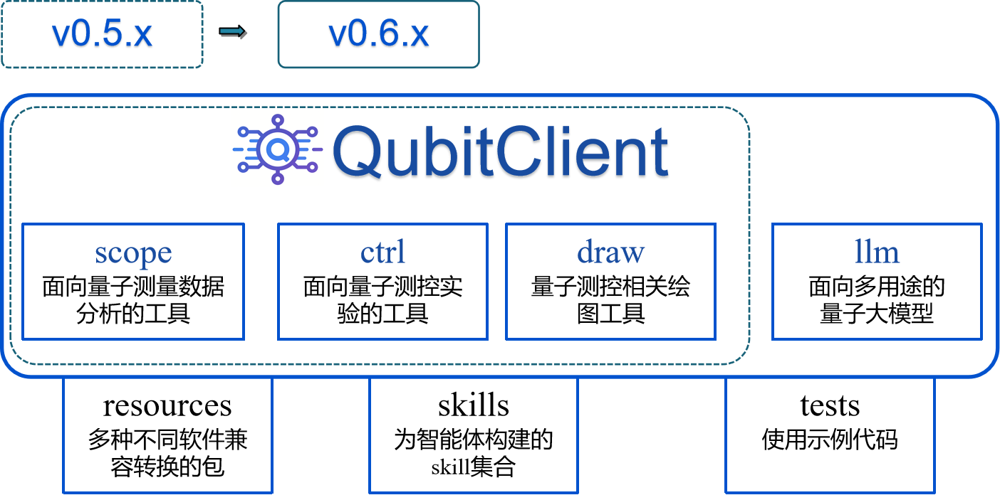

<h1 align="center">
  
  <br>
  QubitClient: 用于量子计算的AI智能体
</h1>

<p align="center">
  <a href="https://pypi.org/project/qubitclient/">
    
  </a>
  <a href="https://www.python.org/downloads/">
    
  </a>
  <a href="https://pypi.org/project/qubitclient/">
    
  </a>
  <!-- <a href="https://github.com/yaqiangsun/qubitclient/stargazers">
    
  </a> -->
  <!-- <a href="https://github.com/yaqiangsun/qubitclient/fork">
    
  </a> -->
  <!-- <a href="https://github.com/yaqiangsun/qubitclient/graphs/contributors">
    
  </a> -->
  <a href="https://github.com/yaqiangsun/qubitclient/issues">
    
  </a>
  <!-- <a href="https://github.com/yaqiangsun/qubitclient/pulls">
    
  </a> -->
  <a href="LICENSE">
    
  </a>
  <a href="https://github.com/yaqiangsun/qubitclient/commits/main">
    
  </a>
  <!-- <a href="https://github.com/yaqiangsun/qubitclient/releases">
    
  </a> -->
  
  
  <br>
  <a href="#-介绍">介绍</a> •
  <a href="#-功能特性">功能特性</a> •
  <a href="#-安装">安装</a> •
  <a href="#-快速开始">快速开始</a> •
  <a href="#-支持的任务类型">任务类型</a> •
  <a href="#-文档与示例">文档</a> •
  <a href="#-许可证">许可证</a>
</p>

<p align="center">
  <b>中文</b> | <a href="README.en.md">English</a>
</p>

---

## 📖 介绍

**QubitClient** 是一个功能强大的AI智能体，用于与 **Qubit 服务**进行高效交互。它封装了丰富的 API 接口，专为量子计算实验数据处理而设计，支持**特征提取**、**参数拟合**、**实验控制**等多种任务，能够实现快速分析二维能谱、功率偏移曲线等关键实验数据，支持多种形式格式转换。

## 📂 项目结构



## ✨ 功能特性

- 🧠 **智能数据分析**：支持二维能谱分析、功率偏移曲线分析等复杂任务。
- 🔬 **多种量子计算任务**：涵盖 S21 峰值检测、最优 π 脉冲、Rabi 振荡、T1/T2 拟合等常见实验分析。
- 📦 **灵活的数据输入**：可直接传入文件路径、NumPy 数组或字典，适配不同数据源。
- ⚡ **批量处理**：轻松同时处理多个数据文件，提高工作效率。
- 🔌 **易于集成**：简洁的 API 设计，可快速融入现有项目流程。
- 🤝 **MCP 协议支持**：基于 MCP 协议的实时量子测量任务控制，实现实验自动化。
- 🤖 **LLM/VLM 集成**：支持大语言模型和视觉语言模型，用于量子测量数据分析与决策。
  - 🟢 **Google Gemma 4**：支持 `google/gemma-4-E4B-it` 模型
  - 🔵 **NVIDIA Ising**：支持 `nv-community/Ising-Calibration-1-35B-A3B` 模型，专为量子校准设计

## 📦 安装

推荐使用 `pip` 进行安装：

```bash
pip install qubitclient
```

如果需要绘图等额外功能，可以安装完整版：

```bash
pip install qubitclient[full]
```


#### 🐳 服务部署（Docker）

```bash
# 初始化部署文件（拷贝 serve_templates 到当前目录）
qubitclient serve init

# 下载模型到 model_zoo 文件夹
qubitclient serve download

# 启动所有服务（proxy、qubitserving、qubitscope）
qubitclient serve up

# 查看服务状态
docker ps
```

## 🚀 快速开始

### 1️⃣ 配置

初始化配置文件：

```bash
qubitclient init
```

这会创建 `qubitclient.json` 和 `.mcp.json` 文件。然后编辑 `qubitclient.json`，填入您的服务器地址和 API 密钥：

```json
{
  "url": "https://your-api-server.com",
  "api_key": "your-api-key"
}
```

### 2️⃣ 使用示例

#### 🧠 NNScope 功能（SPECTRUM2D）

```python
from qubitclient import QubitNNScopeClient, NNTaskName, CurveType
import numpy as np

# 初始化客户端
client = QubitNNScopeClient(url="http://your-server-address:port", api_key="your-api-key")

# 方式1：使用文件路径
file_path_list = ["data/file1.npz", "data/file2.npz"]
response = client.request(
    file_list=file_path_list,
    task_type=NNTaskName.SPECTRUM2D,
    curve_type=CurveType.COSINE
)

# 方式2：使用 NumPy 数组字典
data_ndarray = np.load("data/file1.npz", allow_pickle=True)
dict_list = [data_ndarray]
response = client.request(
    file_list=dict_list,
    task_type=NNTaskName.SPECTRUM2D,
    curve_type=CurveType.POLY
)

# 获取结果
results = client.get_result(response=response)
```

#### 🔬 Scope 功能（OPTPIPULSE）

```python
from qubitclient import QubitScopeClient, TaskName
import numpy as np

client = QubitScopeClient(url="http://your-server-address:port", api_key="your-api-key")

# 准备数据（示例）
dict_list = [{
    "x_data": np.array([...]),
    "y_data": np.array([...])
}]

response = client.request(
    file_list=dict_list,
    task_type=TaskName.OPTPIPULSE  # 可选任务见下方列表
)

results = client.get_result(response=response)
```

#### 🤖 Ctrl 功能（MCP 协议测量S21）

```python
from qubitclient.ctrl import QubitCtrlClient, CtrlTaskName

client = QubitCtrlClient()

# 执行 S21 腔频测量实验
result = client.run(
    task_type=CtrlTaskName.S21,
    qubits=["Q0", "Q1"],
    frequency_start=-40e6,
    frequency_end=40e6,
    frequency_sample_num=101
)

print(result)
```

#### 🤖 LLM 功能（VLM 图像分析）

```python
from qubitclient.llm import QubitLLM, LLMTaskName, ExperimentFamily

# 初始化客户端（自动从 qubitclient.json 读取配置）
llm = QubitLLM()

# 方式1：直接对话
result = llm.chat([
    {"role": "system", "content": "You are a quantum physics expert."},
    {"role": "user", "content": "Explain quantum entanglement"}
])
print(result)

# 方式2：带图像的 VLM 分析
result = llm.chat(
    [{"role": "user", "content": "分析这张图像"}],
    images="measurement.png"
)
print(result)

# 方式3：使用任务 prompt（自动构建消息和 JSON schema）
# QCalEval Q1: 描述图表
result = llm.run(
    LLMTaskName.DESCRIBE_PLOT,
    "test.png",
    experiment_family=ExperimentFamily.RABI
)
print(result)

# QCalEval Q2: 分类实验结果
result = llm.run(
    LLMTaskName.CLASSIFY_OUTCOME,
    "test.png",
    experiment_family=ExperimentFamily.T1
)
print(result)

# QCalEval Q3: 科学推理
result = llm.run(
    LLMTaskName.SCIENTIFIC_REASONING,
    "test.png",
    experiment_family=ExperimentFamily.RAMSEY_T2STAR
)
print(result)

# QCalEval Q4: 评估拟合可靠性
result = llm.run(
    LLMTaskName.ASSESS_FIT,
    "test.png",
    experiment_family=ExperimentFamily.RABI
)
print(result)

# QCalEval Q5: 提取参数
result = llm.run(
    LLMTaskName.EXTRACT_PARAMS,
    "test.png",
    experiment_family=ExperimentFamily.T1
)
print(result)

# QCalEval Q6: 评估实验状态
result = llm.run(
    LLMTaskName.EVALUATE_STATUS,
    "test.png",
    experiment_family=ExperimentFamily.T1
)
print(result)

# 决策任务：基于评估结果给出下一步测量建议
result = llm.run(
    LLMTaskName.DECIDE_NEXT_ACTION,
    evaluation_result={"status": "success", "params": {...}},
    available_actions=["S21", "RABI", "T1"]
)
print(result)
```

## 📋 支持的任务类型

### 🧠 NNScope 任务

| 任务名称 | 描述 | 文档 | 状态 |
|---------|------|---------|---------|
| `NNTaskName.SPECTRUM2D` | 二维频谱数据曲线分割 | [文档](docs/nnscope/SPECTRUM2D.md) | ✅
| `NNTaskName.POWERSHIFT` | 功率偏移曲线分割 | [文档](docs/nnscope/POWERSHIFT.md) | ⏸️
| `NNTaskName.S21VFLUX` | S21 vs Flux 参数曲线分割 | [文档](docs/nnscope/S21VFLUX.md) | ⏸️
| `NNTaskName.SPECTRUM` | 频谱分析 | [文档](docs/nnscope/SPECTRUM.md) | ✅
| `NNTaskName.S21PEAK` | S21 峰值检测 | [文档](docs/nnscope/S21PEAK.md) | ⏸️
| `NNTaskName.S21PEAKMULTI` | S21 峰值检测 | [文档](docs/nnscope/S21PEAKMULTI.md) | ⏸️

### 🔬 Scope 任务

| 任务名称 | 描述 | 文档 | 状态 |
|---------|------|---------|---------|
| `TaskName.S21PEAKMULTI` | 全频段扫描S21全链峰值检测 | [文档](docs/scope/S21PEAKMULTI.md) | ✅
| `TaskName.S21PEAK` | S21 单个峰值优化检测 | [文档](docs/scope/S21PEAK.md) | ✅
| `TaskName.OPTPIPULSE` | 最优 π 脉冲计算 | [文档](docs/scope/OPTPIPULSE.md) | ✅
| `TaskName.RABICOS` | Rabi 振荡余弦第一峰检测 | [文档](docs/scope/RABICOS.md) | ✅
| `TaskName.RAMSEY` | RAMSY 衰减震荡余弦拟合 | [文档](docs/scope/RAMSEY.md) | ✅
| `TaskName.S21VFLUX` | S21 vs Flux 分析 | [文档](docs/scope/S21VFLUX.md) | ✅
| `TaskName.SINGLESHOT` | 单次测量分析 | [文档](docs/scope/SINGLESHOT.md) | ✅
| `TaskName.SPECTRUM` | 频谱分析 | [文档](docs/scope/SPECTRUM.md) | ✅
| `TaskName.T1FIT` | T1 时间拟合 | [文档](docs/scope/T1FIT.md) | ✅
| `TaskName.T2FIT` | T2 时间拟合 | [文档](docs/scope/T2FIT.md) | ✅
| `TaskName.POWERSHIFT` | 功率偏移曲线分析 | [文档](docs/scope/POWERSHIFT.md) | ✅
| `TaskName.SPECTRUM2D` | 二维频谱数据曲线分割 | [文档](docs/scope/SPECTRUM2D.md) | ✅
| `TaskName.DRAG` | DRAG 免交叉点分析 | [文档](docs/scope/DRAG.md) | ✅
| `TaskName.DELTA` | delta优化实验 | [文档](docs/scope/DELTA.md) | ✅
| `TaskName.RB` | 保真度测试 | [文档](docs/scope/RB.md) | ✅

### 🤖 Ctrl 任务

| 任务名称 | 描述 | 详细文档 | 状态 |
|---------|------|---------|---------|
| `CtrlTaskName.S21` | S21 腔频测量实验 | [文档](docs/ctrl/S21.md) | ✅
| `CtrlTaskName.DRAG` | DRAG 免交叉点测量 | [文档](docs/ctrl/DRAG.md) | ✅
| `CtrlTaskName.DELTA` | 频率偏移校准测量 | [文档](docs/ctrl/DELTA.md) | ✅
| `CtrlTaskName.OPTPIPULSE` | 最优 π 脉冲测量 | [文档](docs/ctrl/OPTPIPULSE.md) | ✅
| `CtrlTaskName.POWERSHIFT` | 功率偏移曲线测量 | [文档](docs/ctrl/POWERSHIFT.md) | ✅
| `CtrlTaskName.RABI` | Rabi 振荡测量 | [文档](docs/ctrl/RABI.md) | ✅
| `CtrlTaskName.RAMSEY` | Ramsey 干涉测量 | [文档](docs/ctrl/RAMSEY.md) | ✅
| `CtrlTaskName.S21VSFLUX` | S21 vs Flux 测量 | [文档](docs/ctrl/S21VSFLUX.md) | ✅
| `CtrlTaskName.SINGLESHOT` | 单次测量分析 | [文档](docs/ctrl/SINGLESHOT.md) | ✅
| `CtrlTaskName.SPECTRUM` | 频谱分析测量 | [文档](docs/ctrl/SPECTRUM.md) | ✅
| `CtrlTaskName.SPECTRUM_2D` | 二维频谱测量 | [文档](docs/ctrl/SPECTRUM_2D.md) | ✅
| `CtrlTaskName.T1` | T1 弛豫时间测量 | [文档](docs/ctrl/T1.md) | ✅
| `CtrlTaskName.T2` | T2 弛豫时间测量 | [文档](docs/ctrl/T2.md) | ✅
| `CtrlTaskName.RB` | 随机基准测试 | [文档](docs/ctrl/RB.md) | ✅
| `CtrlTaskName.DATA` | 获取测量数据 | [文档](docs/ctrl/DATA.md) | ✅

### 🤖 LLM 任务

| 任务名称 | 描述 | 详细文档 | 状态 |
|---------|------|----------|---------|
| `LLMTaskName.DECIDE_NEXT_ACTION` | 决策下一步测量目标及参数 | - | ⏸️
| `LLMTaskName.DESCRIBE_PLOT` | 描述图表类型、坐标轴、特征 | QCalEval-Q1 | ⏸️
| `LLMTaskName.CLASSIFY_OUTCOME` | 分类实验结果 (Expected/Suboptimal/Anomalous) | QCalEval-Q2 | ⏸️
| `LLMTaskName.SCIENTIFIC_REASONING` | 科学推理分析 | QCalEval-Q3 | ⏸️
| `LLMTaskName.ASSESS_FIT` | 评估拟合可靠性 | QCalEval-Q4 | ⏸️
| `LLMTaskName.EXTRACT_PARAMS` | 从图表提取参数 | QCalEval-Q5 | ⏸️
| `LLMTaskName.EVALUATE_STATUS` | 评估实验状态 (成功/失败及原因) | QCalEval-Q6 | ⏸️

#### 📊 ExperimentFamily 实验家族

使用 `ExperimentFamily` 枚举指定不同实验类型，自动获取对应的 prompt 背景和参数提取 schema：

| 枚举值 | 描述 | 状态 |
|--------|------|---------|
| `ExperimentFamily.COUPLER_FLUX` | 可调耦合器光谱 | ⏸️
| `ExperimentFamily.CZ_BENCHMARKING` | CZ 门基准测试 | ⏸️
| `ExperimentFamily.DRAG` | DRAG 校准 | ⏸️
| `ExperimentFamily.GMM` | 高斯混合模型 | ⏸️
| `ExperimentFamily.MICROWAVE_RAMSEY` | 微波 Ramsey | ⏸️
| `ExperimentFamily.MOT_LOADING` | MOT 加载 | ⏸️
| `ExperimentFamily.PINCHOFF` | Pinch-off 测量 | ⏸️
| `ExperimentFamily.PINGPONG` | PingPong 校准 | ⏸️
| `ExperimentFamily.QUBIT_FLUX_SPECTROSCOPY` | 量子比特通量光谱 | ⏸️
| `ExperimentFamily.QUBIT_SPECTROSCOPY` | 量子比特光谱 | ⏸️
| `ExperimentFamily.QUBIT_SPECTROSCOPY_POWER_FREQUENCY` | 二维功率频率光谱 | ⏸️
| `ExperimentFamily.RABI` | Rabi 振荡 | ⏸️
| `ExperimentFamily.RABI_HW` | Rabi 硬件 | ⏸️
| `ExperimentFamily.RAMSEY_CHARGE_TOMOGRAPHY` | Ramsey 电荷层析 | ⏸️
| `ExperimentFamily.RAMSEY_FREQ_CAL` | Ramsey 频率校准 | ⏸️
| `ExperimentFamily.RAMSEY_T2STAR` | T2* 退相干 | ⏸️
| `ExperimentFamily.RES_SPEC` | 共振器光谱 | ⏸️
| `ExperimentFamily.RYDBERG_RAMSEY` | Rydberg Ramsey | ⏸️
| `ExperimentFamily.RYDBERG_SPECTROSCOPY` | Rydberg 光谱 | ⏸️
| `ExperimentFamily.T1` | T1 弛豫 | ⏸️
| `ExperimentFamily.T1_FLUCTUATIONS` | T1 涨落 | ⏸️
| `ExperimentFamily.TWEEZER_ARRAY` | 光镊阵列 | ⏸️


| 枚举值 | 描述 | 状态 |
|--------|------|---------|
| `ExperimentFamily.S21` | 腔频校准 | ⏸️

#### 🎯 ExperimentType 实验类型

使用 `ExperimentType` 枚举指定 QCalEval 数据集中的 87 个具体测试用例（用于评估）。详细列表请参考 [实验类型文档](docs/llm/EXPERIMENT_TYPE.md)。

## 📁 数据格式说明

不同任务对输入/输出数据格式有不同要求，请参考对应任务的详细文档（上面链接）获取具体说明。

## 🧪 运行测试示例

项目提供了丰富的测试示例，位于 [`tests`](tests) 目录下：

```bash
# 运行 NNScope 测试
python tests/test_nnscope.py

# 运行 Scope 测试
python tests/test_scope.py

# 运行 Ctrl 测试
python tests/test_ctrl_mcp.py

# 运行 LLM 测试
python tests/test_llm.py
```

## ⚙️ LLM/VLM 配置

在 `qubitclient.json` 中配置 LLM/VLM（创建或编辑此文件）：

```json
{
  "llm": {
    "api_key": "your-api-key",
    "base_url": "https://your-llm-endpoint.com/v1",
    "model": "nvidia/Ising-Calibration-1-35B-A3B"
  }
}
```

### 支持的模型

| 模型 | 描述 | 推荐用途 |
|------|------|---------|
| `nvidia/Ising-Calibration-1-35B-A3B` | NVIDIA Ising，专门针对量子校准任务优化 | **量子测量数据分析首选** |
| `google/gemma-4-E4B-it` | Google Gemma 4，多模态推理能力 | 通用图表分析与推理 |
| `gpt-4o` | OpenAI GPT-4o | 通用对话与分析 |

支持的配置方式（优先级从低到高）：
1. 默认值（gpt-4o）
2. 用户目录 `~/qubitclient.json`
3. 环境变量 `OPENAI_API_KEY`, `OPENAI_BASE_URL`, `OPENAI_MODEL`
4. 运行目录 `./qubitclient.json`
5. 构造函数参数（最高优先级）

## 🔧 格式转换与工具集成

如需将数据转换为特定格式或集成其他工具，请参考 [`resources`](resources) 目录下的实用脚本。

## 📝 更新日志

### 近期更新
- 🐳 **新增 Docker 服务部署**：新增 `qubitclient serve` 命令，支持一键初始化和启动 qubitscope、qubitserving、proxy 三个服务
- 🤖 **新增 VLM 模型支持**：
  - 🔵 **NVIDIA Ising** (`Ising-Calibration-1-35B-A3B`)：专为量子校准任务优化的 VLM
  - 🟢 **Google Gemma 4** (`gemma-4-E4B-it`)：多模态推理能力，支持图表分析
- 🤖 **新增 QCalEval 基准测试**：集成 NVIDIA QCalEval 数据集，支持 6 种 VLM 任务（Q1-Q6）和 87 种实验类型
- 🤖 **新增实验背景模块**：为 22 种实验家族提供专业物理背景描述
- 🤖 **新增 LLM 决策模块**：支持基于评估结果自动决策下一步测量
- 🤖 **新增 LLM 模块**：集成大语言模型和视觉语言模型，支持量子测量数据分析与决策
- 🎨 **优化绘制功能**：统一结果绘制风格
- 🤝 **增加 Ctrl 功能包**：基于 MCP 协议的实时测量任务
- 📈 **增加 DRAG 分析功能**：支持 DRAG 任务数据分析
- 🧩 **增加 scope 功能包**：新增多种拟合任务
- 📐 **增加曲线类型**：支持余弦类型曲线拟合
- 🏗️ **构建基础项目**：完成基础功能与结构搭建

## 🤝 贡献指南

欢迎通过 [Issues](https://github.com/yaqiangsun/qubitclient/issues) 提交问题或建议。如果您想贡献代码，请 Fork 本仓库并提交 Pull Request。

## 📄 许可证

本项目采用 **GPL-3.0 许可证**。详情请参阅 [LICENSE](LICENSE) 文件。

---

<!-- <p align="center">
  Made with ❤️ by yaqiangsun
</p> -->